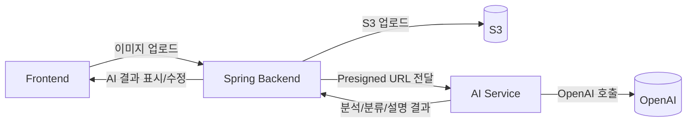

# Python AI Service (FastAPI)

중고거래 자동화 파이프라인의 AI 단계(이미지 분석 → 카테고리 분류 → 설명 생성)를 담당하는 서비스입니다.  
Spring 백엔드가 이 서비스를 HTTP로 호출하며, OpenAI 모델이 응답을 생성합니다.

## 주요 동작
- **이미지 분석**: 이미지 URL을 받아 브랜드/모델/상태/OCR 등을 추출
- **카테고리 분류**: 기존 카테고리 목록(leaf 중심)과 별칭/키워드를 기반으로 매핑
- **설명 생성**: 짧고 사실 기반의 판매글을 생성하고 `auction_register_req`를 포함
- **폴백 처리**: OpenAI 호출 실패/형식 오류 시 기본 규칙 기반 결과로 보정

## 시스템 아키텍처


## 실행
```bash
uvicorn app.main:app --reload --host 0.0.0.0 --port 8001
```

## 환경 변수
- `OPENAI_API_KEY`: 실제 모델 연동 시 사용
- `OPENAI_MODEL`: 기본 `gpt-4.1-mini`

## 엔드포인트
- `POST /ai/analyze-image`
- `POST /ai/classify-category`
- `POST /ai/generate-description`
- `GET /health`

## 참고
- 이미지 URL은 **OpenAI에서 접근 가능해야** 하므로 S3는 presigned URL을 사용합니다.
- 분류 품질 향상을 위해 `backend/src/main/resources/category-aliases.json` 별칭을 사용합니다.
