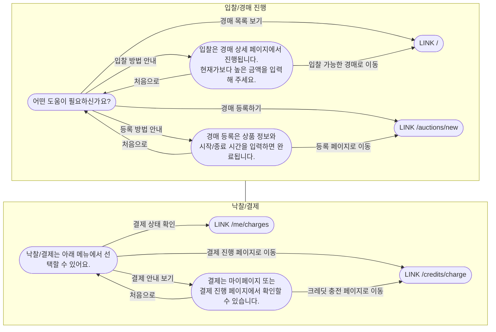

# Chatbot DB 명세 및 구현 요약

## DB 명세
### chat_scenarios
- `id` (PK, bigint)
- `scenario_key` (varchar 100, unique)
- `title` (varchar 200)
- `description` (varchar 500, nullable)
- `active` (boolean)
- `created_at`, `updated_at`

### chat_nodes
- `id` (PK, bigint)
- `scenario_id` (FK -> chat_scenarios.id)
- `node_key` (varchar 120, unique per scenario)
- `text` (varchar 1000)
- `is_root` (boolean)
- `is_terminal` (boolean)
- `sort_order` (int)
- `created_at`, `updated_at`

### chat_options
- `id` (PK, bigint)
- `node_id` (FK -> chat_nodes.id)
- `label` (varchar 200)
- `next_node_id` (FK -> chat_nodes.id, nullable)
- `action_type` (enum: NONE, LINK, API)
- `action_target` (varchar 500, nullable)
- `sort_order` (int)
- `created_at`, `updated_at`

## 구현 클래스
### 엔티티
- `backend/src/main/java/noonchissaum/backend/domain/chatbot/entity/ChatScenario.java`
- `backend/src/main/java/noonchissaum/backend/domain/chatbot/entity/ChatNode.java`
- `backend/src/main/java/noonchissaum/backend/domain/chatbot/entity/ChatOption.java`
- `backend/src/main/java/noonchissaum/backend/domain/chatbot/entity/ChatActionType.java`

### 레포지토리
- `backend/src/main/java/noonchissaum/backend/domain/chatbot/repository/ChatScenarioRepository.java`
- `backend/src/main/java/noonchissaum/backend/domain/chatbot/repository/ChatNodeRepository.java`
- `backend/src/main/java/noonchissaum/backend/domain/chatbot/repository/ChatOptionRepository.java`

### DTO
- `backend/src/main/java/noonchissaum/backend/domain/chatbot/dto/req/ChatNextReq.java`
- `backend/src/main/java/noonchissaum/backend/domain/chatbot/dto/res/ScenarioSummaryRes.java`
- `backend/src/main/java/noonchissaum/backend/domain/chatbot/dto/res/ChatNodeRes.java`
- `backend/src/main/java/noonchissaum/backend/domain/chatbot/dto/res/ChatOptionRes.java`
- `backend/src/main/java/noonchissaum/backend/domain/chatbot/dto/res/ChatActionRes.java`
- `backend/src/main/java/noonchissaum/backend/domain/chatbot/dto/res/ChatNextRes.java`

### 서비스/컨트롤러
- `backend/src/main/java/noonchissaum/backend/domain/chatbot/service/ChatbotService.java`
- `backend/src/main/java/noonchissaum/backend/domain/chatbot/controller/ChatbotController.java`

## 시나리오 흐름 (Mermaid)

## 시나리오 상세

### 시나리오 1: 입찰/경매 진행 (auction_flow)

#### 루트 노드 (101)
- **텍스트**: "어떤 도움이 필요하신가요?"
- **옵션**:
  1. 경매 목록 보기 → `LINK /` (홈 페이지)
  2. 경매 등록하기 → `LINK /auctions/new` (경매 등록 페이지)
  3. 입찰 방법 안내 → 노드 102로 이동
  4. 등록 방법 안내 → 노드 103으로 이동

#### 입찰 방법 안내 노드 (102)
- **텍스트**: "입찰은 경매 상세 페이지에서 진행됩니다. 현재가보다 높은 금액을 입력해 주세요."
- **옵션**:
  1. 입찰 가능한 경매로 이동 → `LINK /` (홈 페이지)
  2. 처음으로 → 노드 101로 이동

#### 등록 방법 안내 노드 (103)
- **텍스트**: "경매 등록은 상품 정보와 시작/종료 시간을 입력하면 완료됩니다."
- **옵션**:
  1. 등록 페이지로 이동 → `LINK /auctions/new` (경매 등록 페이지)
  2. 처음으로 → 노드 101로 이동

### 시나리오 2: 낙찰/결제 (payment_flow)

#### 루트 노드 (201)
- **텍스트**: "낙찰/결제는 아래 메뉴에서 선택할 수 있어요."
- **옵션**:
  1. 결제 진행 페이지로 이동 → `LINK /credits/charge` (크레딧 충전 페이지)
  2. 결제 상태 확인 → `LINK /me/charges` (충전 대기 목록 페이지)
  3. 결제 안내 보기 → 노드 202로 이동

#### 결제 안내 노드 (202)
- **텍스트**: "결제는 마이페이지 또는 결제 진행 페이지에서 확인할 수 있습니다."
- **옵션**:
  1. 크레딧 충전 페이지로 이동 → `LINK /credits/charge` (크레딧 충전 페이지)
  2. 처음으로 → 노드 201로 이동

## 프론트엔드 경로 매핑

프론트엔드에서 백엔드 경로를 자동으로 매핑합니다:

| 백엔드 경로 | 프론트엔드 경로 | 설명 |
|------------|----------------|------|
| `/auctions/register` | `/auctions/new` | 경매 등록 페이지 |
| `/auction/register` | `/auctions/new` | 경매 등록 페이지 (변형) |
| `/` | `/` | 홈 페이지 (경매 목록) |
| `/credits/charge` | `/credits/charge` | 크레딧 충전 페이지 |
| `/me/charges` | `/me/charges` | 충전 대기 목록 페이지 |
| `/login` | 필터링됨 | 로그인된 상태에서는 표시 안 함 |

## 주의사항

1. **로그인 페이지 링크**: 로그인된 상태에서는 `/login` 링크가 자동으로 필터링됩니다.
2. **결제 안내 보기**: "결제 안내" 키워드가 포함된 시나리오에서 로그인 페이지 링크는 표시되지 않습니다.
3. **경로 추론**: `actionTarget`이 없는 경우, 최근 메시지 내용을 기반으로 경로를 자동 추론합니다.
